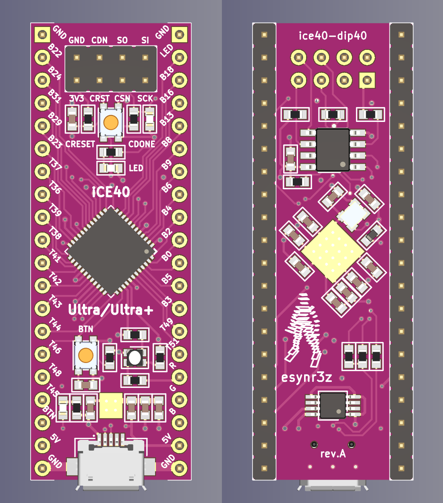

# iCE40 breakout board

Miniature FPGA development board with DIP40 gabarits.

**BOARD IS NOT TESTED YET**

## Features

* Lattice iCE40 Ultra, iCE40 UltraPlus compatible (see Notes)
* Size 17.78mm x 50.8mm (DIP40)
* 12 MHz external generator
* Input power voltage: 5V (USB Micro B)
* USB data lines routed to FPGA
* 8Mb SPI flash for programming
* 34 IO pins available (3.3V)
* CRESET push button and CDONE led
* User led and user push button
* RGB led connected to internal driver

## Notes

Board is routed for iCE5LP4KSG48 (iCE40 Ultra family), but list of supported FPGAs is quite wider:

* iCE40 Ultra - iCE5LP1KSG48, iCE5LP2KSG48, iCE5LP4KSG48
* iCE40 UltraPlus - iCE40UP3KSG48, iCE40UP5KSG48

There is only one difference in pinout between these families you should pay attention for:

| Func | iCE40 Ultra | iCE40 UltraPlus |
|-----:|------------:|----------------:|
| RGB2 |          39 |              41 |
| RGB1 |          40 |              40 |
| RGB0 |          41 |              39 |
